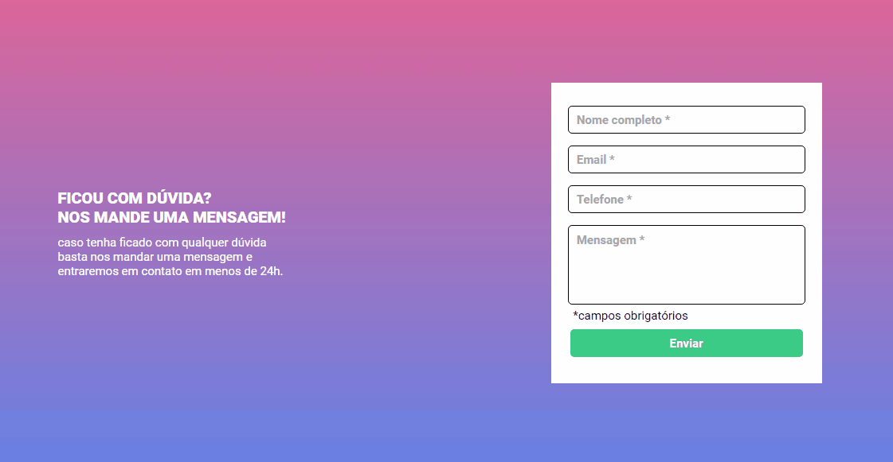

# Project - Form Validation

First project using HTML, CSS and Javascript. Using those 3 languages was able to transform one static web page in one more interactive.



## Table of Contents
- [Overview](#overview)
- [How to use it](#how-to-use-it)
- [Usage](#usage)
  - [Technologies Used](#technologies-used)
- [Features](#features)
- [Project Highlights](#project-highlights)
- [What I Learned](#what-i-learned)
- [Contributing](#contributing)

## Overview
- This project represents the beginning of my web development journey, and it has been an incredible learning experience. Through HTML, CSS, and JavaScript, I've gained valuable knowledge and skills that have laid the foundation for my development career.

## How to use it
1. Clone this repository to your local system:
```bash
git clone https://github.com/Lklisboa/Form-Validation.git
```

2. Go to project diretory:
```
https://github.com/Lklisboa/Form-Validation
```
3. Open the file index.html on your browser to view/use the form.

## Usage

### Technologies Used

- HTML
- CSS
- JavaScript

1. Fill out the form fields.
2. Click the "Submit" button.
3. The form will be validated, and error messages will be displayed if necessary.

## Features

- Client-side form validation.
- Error messages for invalid inputs.
- Customizable validation rules.

## Project Highlights

- **Responsive Design:** The project incorporates responsive design principles, ensuring it looks great on various devices and screen sizes.

- **Form Validation:** I've implemented form validation using JavaScript to enhance user experience and data integrity.

- **Styling:** The CSS styles have been carefully crafted to create an appealing and user-friendly interface.


## What I Learned

During the development of this form validation project, I gained valuable knowledge and skills in the following areas:

- **Client-Side Validation**: I learned how to implement client-side form validation using JavaScript to improve user experience by providing instant feedback on input errors.

- **HTML Forms**: I became proficient in creating and styling HTML forms, including various form elements such as text, inputs and buttons.

- **CSS Styling**: I improved my CSS skills by creating a visually appealing and responsive design for the form and error messages.

- **GitHub Version Control**: I practiced using Git and GitHub for version control, which allowed me to collaborate on the project, track changes, and manage issues effectively.

- **Documentation Skills**: Writing this README.md helped me improve my documentation skills, ensuring that others can understand and use my project.

These skills and experiences have been invaluable, and I look forward to applying them in future projects and continuing to learn and grow as a developer.

## Contributing

Contributions are welcome! Please feel free to give any feedback, pull request or reporting issues.
